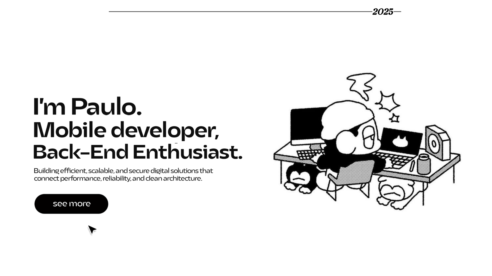

---

## 👋 Welcome! Let´s build something amazing.

Olá, eu sou Paulo, Sou um desenvolvedor em início de carreira, apaixonado por codar e criar soluções práticas. Tenho foco total na área de programação e estou construindo meu caminho profissional através de projetos, estudos e muita dedicação.

---

## 🎯 Sobre mim

- Estudante e praticante de **Desenvolvimento de Software**, com foco em **Back-end**.
- Busco sempre aprender tecnologias modernas, boas práticas e arquiteturas sólidas.
- Uso o GitHub como meu portfólio e vitrine técnica.
- Quero colaborar em projetos reais, crescer tecnicamente e me destacar como desenvolvedor.

---

## 📚 Tecnologias e ferramentas

### Linguagens

### Back‑end

### Banco de dados

### Versionamento e colaboração

### Outros

---

## 🚀 Projetos e aprendizados

Estou desenvolvendo projetos próprios e contribuindo para desafios que me reforcem:

- APIs REST com autenticação e rotas protegidas
- Integração com bancos de dados relacionais e não-relacionais
- Aplicações modulares, usando separação de responsabilidades
- Versionamento adequado e histórico no Git
- Boas práticas de código limpo e refatoração contínua

## 🎯 Objetivos profissionais

- Atuar como desenvolvedor back-end focado em aplicações escaláveis
- Trabalhar com arquiteturas modernas e microserviços
- Contribuir para projetos open source
- Aprimorar habilidades em testes, performance e segurança
- Continuar aprendendo, evoluindo e agregando valor às equipes

---

## 📫 Vamos nos conectar

- LinkedIn: [opaulxs](https://www.linkedin.com/in/opaulxs/)
- GitHub: [github.com/opaulxs](https://github.com/opaulxs)
- E-mail: opaulxs@gmail.com

---

> “Código é a forma como transformamos ideias em realidade.”  
> — Paulo

---

**Obrigado pela visita!** Vamos juntos construir algo incrível com tecnologia. 🚀

